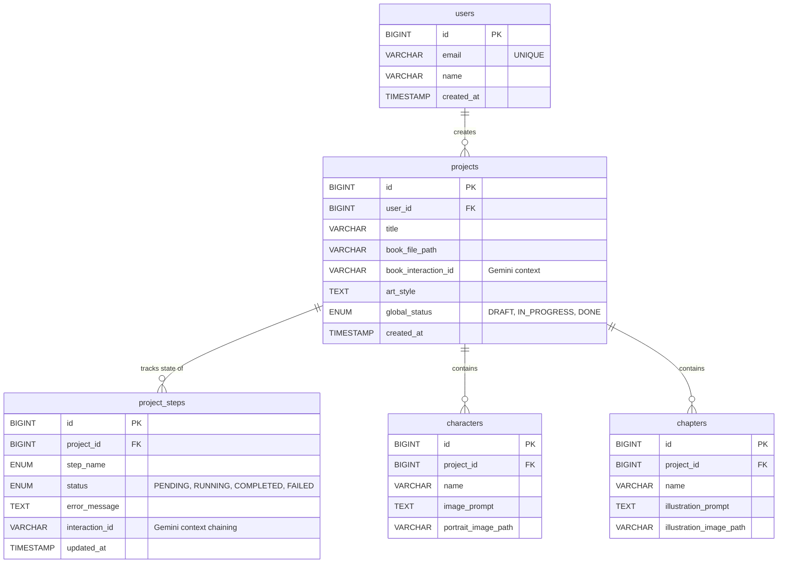

# Architecture

This document will serve as the source of truth for the system design, finalized through AI-assisted planning.

--

## Initial Tech Stack Selection
- **Frontend:** React (JavaScript) - Vite
- **Backend:** Spring Boot (Java 21) - Maven
- **Storage:** MySQL (running via Docker Compose) for project states, Local Filesystem for generated assets.

## Storage Management
### Database Choice: MySQL
The application uses MySQL to maintain the integrity of the 5-step pipeline state. While local JSON files were considered to comply with the "right-sized solution" constraint, a relational database was selected to guarantee ACID atomicity during long-running external API calls and to handle edge cases (like server crashes) safely.

### Database Schema:
The database schema consists of five main tables:

#### Relationships & Cardinality
* **Users to Projects (1 to 0..N):** A user is created upon their first login (email + name) so they might have 0 projects initially. Over time, they can create multiple projects. 
* **Projects to Project Steps (1 to strictly 5):** The moment a user creates a project by uploading the `.txt` file, all 5 steps are generated concurrently and initialized to `PENDING`. A project intrinsically requires these 5 steps.
* **Projects to Characters (1 to 0..2):** Character records do not exist until Step 2 completes. To comply with the strict API cost bounds defined in the requirements, the backend logic enforces a hard cap of 2 characters per project.
* **Projects to Chapters (1 to 0..1):** Chapter records do not exist until Step 4 completes. The backend logic strictly enforces a hard cap of 1 chapter per project.

#### Error State Management & Retry Latency Optimization
Setting the error_message field in project_steps every time a step fails might create a small amount of additional storage overhead, but it is strictly necessary to satisfy the resumable UI requirements.

**The Latency Math:**
* Local MySQL Update: ~1 to 2 milliseconds.
* Gemini API Call: 10,000 to 30,000+ milliseconds (10-30+ seconds).
* The database update accounts for less than 0.01% of the total time it takes to run a step. The bottleneck is entirely the AI generation time, not the local database state management.

When a user retries a failed step, the backend explicitly clears the legacy `error_message` to `NULL` while transitioning the state back to `IN_PROGRESS`. This ensures mathematical state purity (a running step cannot logically hold a previous failure message)

#### Context-chaining Mechanism
To strictly enforce the "Cost discipline" requirement ensuring that the full book text is only sent to Gemini once, the system need to utilize the Gemini REST API's Interactions endpoint for server-side context chaining.

1. **Initialization**: When the .txt file is uploaded, the backend sends the text to the API once and stores the returned session ID in **book_interaction_id** of the **projects** table.

2. **Execution**: As each step executes, it passes the ID from the previous step (starting with **book_interaction_id**, then moving to **interaction_id** of the **project_steps** table) as the **previous_interaction_id** in its REST payload.

3. **Resumability**: When a step succeeds, Gemini returns a new ID, which is saved to that step's row. If the next step fails, a retry simply looks up the last successful **interaction_id** and picks up exactly where it left off.

This architecture entirely eliminates the need to repeatedly upload massive text payloads, drastically reducing network latency and API quota consumption while maintaining perfect cross-session resumability.

#### Concurrency Handling Decision: Atomic State Transition
To satisfy the requirement of preventing duplicate Gemini API calls (like from double-clicks or page refreshes) without exhausting the database connection pool, the backend avoids both long-lived transactions (Pessimistic Locking) and commit-time validation (Optimistic Locking). Instead, it implements an **Atomic State Transition (Claim-Check)** pattern:

1. **Atomic Claim**: When a user triggers a step, the backend executes a fast, sub-millisecond SQL update to claim it: 
   `UPDATE project_steps SET status = 'IN_PROGRESS' WHERE status IN ('PENDING', 'FAILED')`
2. **Execution Outside Transaction**: MySQL guarantees this update is atomic. Only one thread will successfully update the row (returning `updatedRows == 1`). The winning thread proceeds to call the Gemini API *entirely outside* of any database transaction, releasing the DB connection immediately. Losing threads abort safely without triggering the external API.
3. **Stuck-Step Recovery**: The same atomic claim query includes a fallback condition: `OR (status = 'IN_PROGRESS' AND updated_at < [TIMEOUT_THRESHOLD])`. If the server crashes mid-generation, the step remains in `IN_PROGRESS`. However, after a defined timeout (5 minutes), the step can be reclaimed by a new user click, satisfying the "nothing stuck forever" rule without manual database intervention.

This approach ensures API idempotency (repeated requests have the same effect as a single request) and cost discipline while keeping the database connection pool optimal and available under load.

## API Design & Communication

### Internal API Shape (Frontend to Backend)
To satisfy the strict "resumable" requirement, the internal REST API leverages a single **"Fat GET"** endpoint (`GET /api/projects/{id}`). This endpoint aggregates all project states, generated characters, chapters, and error messages into one unified payload. 
For pipeline progression, a unified execution endpoint (`POST /api/projects/{id}/steps/{stepName}/execute`) is used. It applies the atomic lock uniformly across all steps and returns a `202 Accepted`, delegating the blocking AI logic to a background thread to prevent UI freezing.

### External API Integration (Backend to Gemini)
Following the assessment's explicit hints regarding SDK coverage, the backend strictly avoids legacy Java SDKs. Instead, it utilizes Spring Boot's modern `RestClient` to make raw HTTP calls directly to Gemini's `v1beta/interactions` endpoint. This guarantees full access to the required server-side context-chaining features. The system is locked to the current evaluation models: `gemini-2.5-flash` for text and structured output, and `gemini-2.5-flash-image` for visual generation.

### Real-Time Communication Strategy (Short Polling)
To fulfill the "per-item progress" requirement (showing portraits sequentially as they land) without violating the "Right-sized solution" rule, the architecture uses stateless HTTP short-polling rather than stateful WebSockets or Server-Sent Events (SSE).
1. **Background Processing**: The Gemini API calls execute in a Spring `@Async` background thread, writing partial results (like the first of two portraits) to the database as soon as they are ready.
2. **Polling**: The React frontend polls the "Fat GET" endpoint every 2 seconds while a step is `IN_PROGRESS`.
3. **Resiliency over Real-time**: Handling a page refresh (F5) with stateful WebSocket connections requires complex reconnection logic that actively threatens the "Resumability" constraint. Stateless polling makes refresh recovery flawless. The minor overhead of ~15 lightweight HTTP requests over a 30-second window is negligible given the sub-5ms local database query speed.